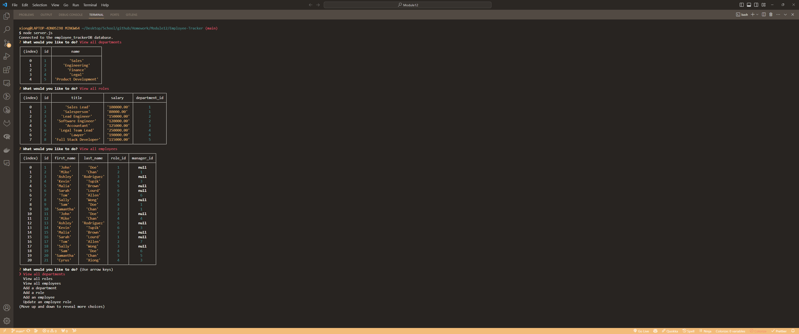
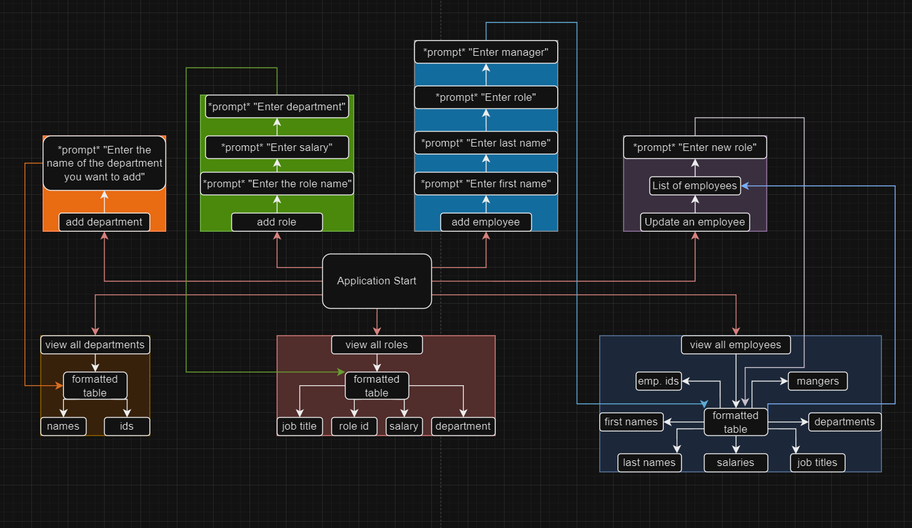

# Employee Tracker

## Description

The Employee Tracker is a command-line application built to help businesses manage their employee database. 

- The motivation for this project was to create a simple and efficient way for businesses to keep track of their employees, roles, and departments.
- This project was built to provide a solution for businesses that need a straightforward, easy-to-use tool for managing their employee data.
- The problem it solves is the often complex and time-consuming task of managing employee data.
- Through this project, I learned more about MySQL, Inquirer, and Node.js, and how they can be used together to create powerful, data-driven applications.

## Installation

To install the Employee Tracker, follow these steps:

1. Clone the repository to your local machine.
2. Navigate to the root directory of the project in your terminal and run `npm install` to install the necessary dependencies.
3. Ensure you have MySQL installed and set up on your machine.
4. In the `db` directory, run the `schema.sql` and `seeds.sql` files in your MySQL client to set up the database and seed it with data.

## Usage

To use the Employee Tracker, navigate to the root directory of the project in your terminal and run `node server.js`. Follow the prompts in the command line to view, add, update, or delete employees, roles, and departments.

Here is a screenshot of the application:

Here is a layout of how it was structured:

